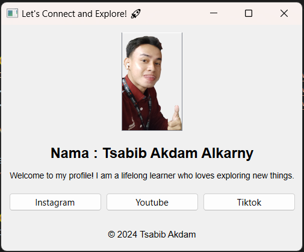

# Self Profile Application
Welcome to my first ui project!! This application is called Self Profile Application. So this application aims to introduce users by displaying names, profile photo, short description, and links to user's social media like Instagram, Youtube, etc.

## Application Display

## Tools Used
To run this project, you'll need:

1. Python: Version 3.10
2. PyQt6: pip install PyQt6
3. Convert .ui files into Python modules: pyuic6 -o main_ui.py main.ui

## Installation
Follow these steps to set up the project:

1. Clone the repository:
git clone https://github.com/kingofaris/Tutorial-Git

2. Navigate to the project directory:
cd Tutorial-Git/Raditya

## File Structure
Overview of the project files and folders:
- controller.py
- main_ui.py
- main.py
- my_profile.png

## Instruction
Press the Instagram button to navigate to the user's Instagram account.
The same applies to the YouTube and TikTok buttons.

